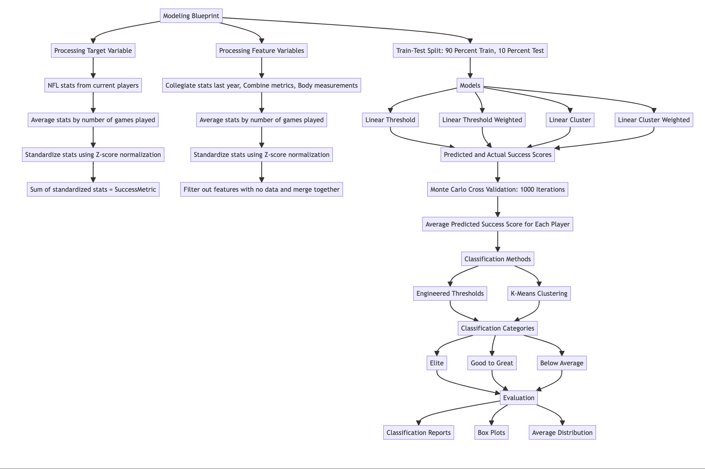

# NFL Draft Assist Tool

This project leverages **Linear Regression**, **Monte Carlo Cross-Validation (MCCV)**, **KMeans Clustering**, and **Manual Thresholding**  to predict the success of NFL prospects. It integrates multiple datasets, including college stats, combine results, player body measurements, and historical NFL performance data.

## Features

- **Linear Regression** used as the primary predictive modeling technique, utilizing it to estimate the success scores of NFL draft prospects based different metrics
- **Monte Carlo Cross Validation** for robust player success prediction
- **KMeans Clustering/Manual Thresholding** to categorize players into tiers
- **Flask Web App** for visualization of predictions
- **Standardized and Normalized Metrics** for accurate comparisons

## Thesis Writing/Tool Explanation

<https://effective-adventure-kgglml5.pages.github.io/thesis/>

## Installation & Setup

### 1. Clone the Repository

```sh
git clone git@github.com:VitalJoseph/vitaljoseph-allegheny-senior-comp-artifact.git
```

### 2. Create and Activate Virtual Environment (OPTIONAL)

```sh
python -m venv artifact_env
source artifact_env/bin/activate
```

### 3. Install Dependencies

```sh
pip install -r requirements.txt
```

### 4. Run in terminal

```sh
python models/mccv/linear_threshold.py
# or
# (BEST MODEL)
python models/mccv/linear_threshold_weighted.py
#or
python models/mccv/linear_cluster.py
#or
python models/mccv/linear_cluster_weighted.py
```

### 5. Run Flask App

```sh
python frontend/app.py
```

## **Model Overview**



## Data Collection and Preprocessing

The datasets used in this study were sourced from multiple historical records, public databases:

### NFL Performance Data (2019–2022)

```csv
Rnd,Pick,Tm,Player,Pos,Age,To,AP1,PB,St,wAV,DrAV,G,nflRec,nflYds,nflTD,nflYears
1,25,BAL,Marquise Brown,WR,22,2024,0,0,4,34,24,74,322,3735,28,6
1,32,NWE,N'Keal Harry,WR,21,2023,0,0,1,7,6,49,64,714,5,5
2,36,SFO,Deebo Samuel,WR,23,2024,1,1,5,47,47,81,334,4792,22,6
2,51,TEN,A.J. Brown,WR,22,2024,0,3,6,66,26,90,446,7026,49,6
```

This dataset has post-draft performance statistics for NFL players[@profootballref] so we can measure how well each player did in their career based on multiple metrics. This dataset is used to get the actual success score or dependent variable used in the regression analysis. The research will analyze these success score metrics to see if pre-draft evaluations will predict NFL success.

There are 17 important metrics in the NFL performance dataset:

- Rnd (Round) & Pick (Overall): Where was a player drafted? We can see if players drafted in earlier rounds outperform those drafted later.
- Pos (Position): Helps to identify position value and trends in scouting for specific roles.
- Age: The age a player enters the NFL could impact longevity and development trajectory.
  - Mean: 22.10
  - Range: [21.00, 25.00]
- To (Last Year): The final year of the player’s career helps to measure career longevity and sustainability of success.
  - Mean: 2022.86
  - Range: [2018.00, 2024.00]
- AP1 (First Team All Pro): How many times a player was selected to the All-Pro team. A measure of elite success; players with this are considered top in the league at there position.
  - Mean: 0.04
  - Range: [0.00, 1.00]
- PB (Pro Bowl): Another measure of success; how a player is viewed by peers, coaches and fans.
  - Mean: 0.17
  - Range: [0.00, 3.00]
- St (Years as Primary Starter): Consistency and did the player develop into a long-term contributor.
  - Mean: 1.14
  - Range: [0.00, 7.00]
- wAV (Weighted Career AV): A cumulative measure of career contributions.
  - Mean: 10.88
  - Range: [0.00, 66.00]
- DrAV (Weighted AV for Drafting Team): How well did a player’s value translate to the team that drafted them? This is key to evaluating draft efficiency.
  - Mean: 9.78
  - Range: [0.00, 51.00]
- G (Games Played): Basic availability metric to see how often a player was healthy and used.
  - Mean: 40.95
  - Range: [1.00, 114.00]
- Receiving Metrics (nflRec, nflYds, nflTD, nflYears): Receiving statistics are key for skill position players like wide receivers and tight ends. One of the bigger indicators of production in the sport for these positions.
  - nflRec:
    - Mean: 103.87
    - Range: [0.00, 558.00]
  - nflYds:
    - Mean: 1354.68
    - Range: [0.00, 7531.00]
  - nflTD:
    - Mean: 7.88
    - Range: [0.00, 49.00]
  - nflYears:
    - Mean: 3.83
    - Range: [1.00, 7.00]

### College Statistics (2019–2022)

```csv
Player,Team,Conf,Class,Pos,G,Rec,Yds,Y/R,TD,Y/G,HSrank
Marquise Brown,Oklahoma,Big 12,JR,WR,14,75,1318,17.6,10,94.1,3
N'Keal Harry,Arizona State,Pac-12,JR,WR,12,73,1088,14.9,9,90.7,5
Deebo Samuel,South Carolina,SEC,SR,WR,12,62,882,14.2,11,73.5,3
A.J. Brown,Ole Miss,SEC,JR,WR,12,85,1320,15.5,6,110.0,4
```

This dataset has a player’s college level performance so we can see how they performed before entering the NFL. This is used to measure overall college production and how well college performance predicts to NFL success.

Metrics and their Importance:

- Player, Team, Conf (Conference), Class, Pos (Position): So we can put performance into context with the competition and positional demand.
- Conf (Conference):
  - Mean: 6.68
  - Range: [1.00, 10.00]
- G (Games Played): Durability and experience at the college level.
  - Mean: 12.14
  - Range: [8.00, 15.00]
- Receiving statistics: Core statistics for skill position players to measure production.
  - Rec (Receptions):
    - Mean: 63.65
    - Range: [21.00, 117.00]
  - Yds (Receiving Yards):
    - Mean: 960.20
    - Range: [285.00, 1856.00]
  - TD (Touchdowns):
    - Mean: 8.46
    - Range: [0.00, 23.00]
  - Y/R (Yards per Reception): Measures efficiency per catch, big play ability.
    - Mean: 15.25
    - Range: [8.80, 23.10]
  - Y/G (Yards per Game): Accounts for consistency across different game samples.
    - Mean: 78.40
    - Range: [2.00, 149.10]
- HSrank: Number of ranking stars each player was classified by in highschool (Higher is better)
  - Mean: 3.25
  - Range: [0.00, 5.00]

### NFL Combine Measurements (2019–2022)

```csv
Player,40yd,Vert(in),Bench,Broad(in),3cone,Shuttle
Marquise Brown,4.27,n/a,n/a,n/a,n/a,n/a
N'Keal Harry,4.53,38.5,27,122,n/a,n/a
Deebo Samuel,4.48,39.0,15,122,7.03,4.14
A.J. Brown,4.49,36.5,19,120,n/a,4.35
```

This dataset includes physical and athletic testing results from the NFL Combine where prospects go through standardized drills. These metrics are heavily weighted in scouting but their actual correlation to NFL success can vary​[@meil2018success_using_nfl_combine]. My modeling strategies will look into if athletic testing results are overvalued or if they are heavy indicators for professional success.

Metrics and their Importance:

- 40yd Dash(sec) (Speed Test): Important for skill positions like WRs, CBs, and RBs where speed is key.
  - Mean: 4.47
  - Range: [4.26, 4.73]
- Vert (Vertical Jump) & Broad (Broad Jump): Measures lower body explosiveness which is important for positions that require jumping ability like WRs and DBs.
  - Vert(in):
    - Mean: 35.51
    - Range: [29.00, 44.50]
  - Broad(in):
    - Mean: 124.39
    - Range: [112.00, 140.00]
- Bench Press(repetitions): Tests upper body strength often used for linemen but less predictive for skill positions, repetitions of 225lbs.
  - Mean: 14.98
  - Range: [6.00, 27.00]
- 3 Cone Drill & Shuttle: Tests agility and change of direction speed which is important for positions that require quick movements like slot receivers, defensive backs.
  - 3 Cone(sec):
    - Mean: 6.99
    - Range: [6.56, 7.40]
  - Shuttle(sec):  
    - Mean: 4.26
    - Range: [3.99, 4.62]

- Body Measurements (Height, Weight, Hand Size, Arm Length, etc.)

```csv
Player,Height(in),Weight,Hand(in),Arm(in),Wingspan(in)
Marquise Brown,69.375,166,9,30.5,71.75
N'Keal Harry,74.375,228,9.5,33,78.25
Deebo Samuel,71.25,214,10,31.375,75.125
A.J. Brown,72.5,226,9.75,32.875,78
```

This dataset includes physical body dimensions like height, weight, and reach. NFL teams have historical preferences for certain body types at different positions[@mays2019draft]. Incorporating these metrics will show if these physical measurements really matter or just lead to bias in scouting by comparing models with different weighted values of these metrics.

Metrics and their Importance:

- Height: Catch radius, higher capability, etc.
  - Mean: 72.83
  - Range: [68.00, 77.50]
- Weight: Injury reduction, muscle mass.
  - Mean: 201.32
  - Range: [155.00, 238.00]
- Hand Size: Impact on ball security and catching ability, especially for QBs and WRs.
  - Mean: 9.42
  - Range: [7.88, 10.75]
- Arm Length & Wingspan: Advantages in blocking, tackling and catching.
  - Arm(in):
    - Mean: 31.82
    - Range: [28.50, 35.25]
  - Wingspan(in):
    - Mean: 76.20
    - Range: [70.00, 83.88]

## Data Cleaning and Merging

Before modeling, data was pre-processed to clean and fill in missing values. This was done using a Python framework, mostly pandas for data manipulation and cleaning and numpy for numerical operations and missing data imputation. These tools allowed for efficient filtering, normalizing and structuring of the data to get it ready for machine learning.

For the NFL performance dataset, steps in the preprocessing phase included standardization, where NFL career statistics were divided by the number of professional years (nflYears) to calculate per-year averages. Certain metrics were also z-score normalized to ensure comparability across different scales[@singh-etal.2020normilization]. Missing values in the dataset were handled by representing them as `np.nan` as shown in the code blocks below, allowing for consistent processing using Python libraries. Additionally, some values required contextual interpretation to ensure that their meaning was accurately captured and appropriately represented within the dataset.

For the rest of the data, missing values across the datasets were handled by replacing them with np.nan. This ensures that missing data points are properly recognized for further cleaning or exclusion during preprocessing.

```python
combined_data_combine.fillna(np.nan, inplace=True)
```

Conferences were ranked numerically based on historical strength to create a schedule strength feature. Unlisted conferences were set to the lowest ranking so everything is consistent across the dataset.[@cfbconferences]

```python
conference_rankings = {
    'SEC': 10,
    'Big Ten': 9,
    'Big 12': 8,
    'Pac-12': 7,
    'ACC': 6,
    'AAC': 5,
    'MWC': 4,
    'C-USA': 3,
    'Ind': 2,
    'CAA': 1
}

# Map conference names to their rankings, default to 1 for any 
# conference not listed
college_statistics['ConfRank'] = college_statistics['Conf'].map(
    conference_rankings).fillna(1)
```

The various datasets — college statistics, measurements, and combine results — were merged on the Player field which is the unique identifier. This ensures features and target variables line up for modeling.

```python
# Merge datasets on Player column
data = college_statistics.merge(measurements, on="Player").merge(
    combine_statistics, on="Player")

# Ensure that the players in the target and features match
merged_data = data.merge(nfl_statistics[['Player', 'SuccessMetric']], 
    on='Player', how='inner')
```

40 yard dash times were inverted so faster is better. Players who played in 7 or fewer games in their final college season were excluded to focus on more reliable samples.

```python
# Faster is better
merged_data['40yd_inv'] = 1 / merged_data['40yd']

# Exclude players with 7 or fewer games played in college
merged_data = merged_data[merged_data['G'] > 7].reset_index(
    drop=True)
```

All numerical features were standardized with StandardScaler. This allows features which had different units and ranges to be comparable on the same scale.

```python
# Standardize the averaged metrics (normalize by 
# standard deviation)
nfl_statistics[normalized] = scaler.fit_transform(nfl_statistics[
    [metric + '_avg' for metric in nfl_metrics_to_normalize]])

# Normalize the feature metrics (standard deviation normalization)
features_normalized = scaler.fit_transform(features)
```

Finally all datasets were merged again on the Player field after normalization and cleaning. The final merged dataset ensures all modeling features and success metrics are associated with the correct player.

```python
# Merge datasets on Player column
data = college_statistics.merge(measurements, on="Player").merge(
    combine_statistics, on="Player")

# Ensure that the players in the target and features match
merged_data = data.merge(nfl_statistics[['Player', 'SuccessMetric']], 
    on='Player', how='inner')
```

A key feature, SuccessMetric, was engineered to represent an NFL player’s performance and was then used as the target variable for modeling. It was the sum of z-scored values for career average reception statistics, accolade statistics(e.g, AP1, pro bowl, starter) and wAV for each player. The statistics were avergaed by the number of games played for each player.

Below is the formula used to calculate the Success Score (Target Variable) of each current NFL player:
$$
SuccessMetric = Z(\text{nflYds/G}) + Z(\text{nflTDs/G}) + Z(\text{nflRec/G}) + Z(\text{AP1/G}) + Z(\text{PB/G}) + Z(\text{St/G}) + Z(\text{wAV})
$$  

where $Z(x)$ represents the z score normalization of feature $( x )$, defined as:  

$$
Z(x) = \frac{x - \mu_x}{\sigma_x}
$$  

with $(\mu_x )$ as the mean and $( \sigma_x )$ as the standard deviation of the respective metric across all players.

## Modeling Approach

Linear Regression is used as the primary modeling technique to estimate the success scores of NFL draft prospects based on their college statistics, combine metrics and body measurements. Linear regression is used to predict a continuous dependent variable based on one or more independent variables. In this case we want to model the relationship between the features (metrics) and the target variable (SuccessMetric or success scores for players) and make predictions on new data. Linear Regression is implemented using the `LinearRegression` class from the Python machine learning library `scikit-learn`. This library provides a simple interface to apply regression and includes functionality to fit, predict and evaluate models. The LinearRegression class in `scikit-learn` uses ordinary least squares (OLS) to find the best fitting line through the data.

To evaluate the model we use Monte Carlo Cross Validation (MCCV) by splitting the dataset into training and testing sets multiple times.

### Monte Carlo Cross Validation

To get a accurate evaluation and avoid overfitting, Monte Carlo Cross Validation (MCCV) is used. MCCV involves splitting the dataset into training and testing subsets, training a model on the training set, and evaluating it on the test set. For this project, 1000 iterations of MCCV were performed, each time generating a new random split of the data. In every iteration, a Linear Regression model was trained on a unique subset and used to predict player success scores based on pre-draft features.

Using this repeated random sampling approach has several advantages over a single train-test split. It exposes the model to many data partitions, so performance metrics can be averaged across many different scenarios. This gives a more reliable estimate of the model’s ability to generalize to new players. By averaging results over 1000 runs, the evaluation is less sensitive to any particular random split of the data, so the conclusions drawn from the model’s performance are stronger.

Each iteration of MCCV ties into the train-test split and parameter setup below, where the data is split, the model is trained and the predictions are validated.

### Train Test Split and Parameters

For every iteration of the MCCV, the dataset is split into training and testing sets using the `train_test_split` function from `scikit-learn`. This function randomly partitions the dataset into two parts, one for training the model and another for testing its performance. The parameters used are:

- `features`: The independent variables (predictors) used to train the model. These are going to be college statistics, physical measurements and combine metrics for a player.

- `target`: The dependent variable (response variable) the model is trying to predict. In this case it’s the NFL success score for a player.

- `test_size`: The proportion of the dataset used for the test set. For this model test_size=0.1, a value of 0.1 means 10% of the data is used for testing and 90% for training. This ensures a large test set for model generalization across different Monte Carlo iterations.

- `random_state`: A variable to ensure reproducibility of the train test split by setting a fixed random seed for each iteration. In MCCV, random_state=i (i changes with each iteration) to get different train test splits across multiple runs to reduce bias and improve the strength of the evaluation.

The `train_test_split` function returns four variables:

- `X_train`: The features used for training the model. It’s 90% of the dataset in each iteration.
- `X_test`: The features used for testing. It’s 10% of the dataset and is used to see how well the trained model generalizes to new data.
- `y_train`: The target values corresponding to X_train. These are the actual success scores the model learns from during training.
- `y_test`: The target values corresponding to X_test. These are the actual success scores used to compare with the model’s predictions to measure accuracy and performance.

This is done for each iteration in MCCV, so the model is made on multiple versions of the dataset. By training and testing on different subsets the approach gives a better evaluation of the model’s prediction and reduces overfitting.

After setting up the framework with Linear Regression, Monte Carlo Cross Validation and train-test splitting, the next step was to develop and apply specific models to predict and categorize player success. Four models were created based on how the predictions were turned into player categories and how the models handled weighting. Each model is a slightly different way of mapping success scores into categories, which I’ll explain below.

### Models

Four models were built to predict and categorize NFL prospects based on pre-draft data: Linear Threshold, Linear Threshold Weighted, Linear Cluster, and Linear Cluster Weighted. Each model used the same underlying prediction method, Linear Regression with Monte Carlo Cross Validation, but differed in how they categorized players and whether or not they used manually engineered feature weights.

Linear Threshold used a standard OLS regression without custom feature weights. Player success scores were categorized into tiers (Elite, Good to Great, Below Average) based on fixed, manually chosen thresholds.

Linear Threshold Weighted applied custom-designed feature weights to the linear regression, but still used the same fixed thresholds.

Linear Cluster used unweighted OLS predictions but instead of manual thresholds, it grouped players using KMeans clustering on the predicted success scores. This allowed natural groupings in the data to determine player tiers.

Linear Cluster Weighted combined both feature engineering and dynamic categorization. It used the manually weighted feature regression and grouped players using KMeans clustering, blending guided feature importance with data-driven categorization.

By building these four models, we explored how feature weighting and different categorization methods affect NFL draft prospect evaluation.

Throughout the MCCV process predicted success scores, actual scores and their corresponding categories were saved to evaluate prediction consistency and accuracy across multiple data splits.

### Feature Engineering

Feature engineering played a crucial role in ensuring that the model accurately captured the relationships between pre-draft metrics and NFL success. Instead of treating all features equally, manual weighting was applied to emphasize the relative importance of certain metrics in predicting success. This approach allowed for a different interpretation of how specific attributes contribute to a player's transition from college football to the professional level compared to not using wieghted features and relying on OLS to learn weights for each feature.

#### Weighted Metrics for Predictive Modeling

As an alternative to OLS, custom weights were assigned to each feature that reflect how much they may contribute to NFL success based on personal intangibles and knowledge. I looked at what historically correlates best for players in the NFL as well as leveraged my personal knowledge and gave those metrics more influence in the model by using larger coefficents. That way, the really important statistics, like receptions, yards and touchdowns, have much more significance when determining success values. In this way, we can guide the model to focus on the hypothesized high impact statistics and focus less on the others.

Weights were applied directly to the model like this:

```python
    # Define own custom weights 
    custom_weights = np.array([1, 1, 1, .5, 1, .25, 4, .25, 
        .1, .1, .1, .1, .1, .5])

    # Manually set the coefficients
    model.coef_ = custom_weights
```

Terminal Ouput shows which weights correlate to the specfic features

```
=== Engineered Model Coefficients ===

Rec: 1.000
Yds: 1.000
Y/R: 1.000
TD: 0.500
Y/G: 1.000
G: 0.250
ConfRank: 4.000
40yd_inv: 0.250
Height(in): 0.100
Weight: 0.100
Hand(in): 0.100
Arm(in): 0.100
Wingspan(in): 0.100
HSrank: 0.500
```

#### Weighted SuccessMetric Calculation

When engineering the target variable to reflect the importance of different NFL performance statistics, different NFL statistics were combined. These included yards, touchdowns, receptions and accolade statistics like All-Pro selections and Pro Bowl appearances. Each of those components were given a specific weight based on how much they actually correlated with evaluating a player's overall professional success.

That weight was determined by how much each statistic has historically correlated in evaluating a player's impact in the NFL. Receiving yards and touchdowns got higher weights because they're directly tied to a team's offense and a player's longevity in the league[@cherryetal2017correlation]. Pro Bowl selections, Number of years started, and weighted Approximate Value (wAV) were given lower weights to account for other contributions that might not be as directly measurable like player progression or decline within a players full career. All-Pro team selections were weighted higher because this is a direct reflection of being elite, or beingn regarded as best in the position, and not commonly given out. So I weighted this metric higher to hold more significance.

```python
# Define weights for SuccessMetric calculation
success_metric_weights = {
    'nflYds_avg_normalized': .6,
    'nflTD_avg_normalized': .5,
    'nflRec_avg_normalized': .6,
    'AP1_avg_normalized': .6,
    'St_avg_normalized': .4,
    'PB_avg_normalized': .4,
    'wAV_normalized': .4
}
```

By incorporating personal and reliable knowledge into both feature selection and target variable construction, this approach to feature engineering made it possible to start thinking about possible limitations of OLS modeling for these kinds of data. The goal was to produce real-world scouting insights and performance expectations, so validating the OLS strategy and understanding its strengthsand limits is essential.

After generating player success predictions with Linear Regression and feature importance through engineering, the next step was to turn those continuous success scores into something actionable. Instead of just evaluating model performance with raw error metrics, players were grouped into tiers to mimic how NFL teams scout, rank and differentiate prospects. This section outlines the tiering strategies used to turn success predictions into meaningful groups.

### Categorization Methods

Here are the methods used, manual thresholding and KMeans clustering, to categorize NFL prospects based on their predicted and actual success scores: manual threshold-based categorization and clustering-based categorization. Both methods looked at player performance and potential based on pre-draft data and predicted success in the NFL but used different ways to turn numerical success metrics into player categories.

#### Need for Categorization

While traditional model evaluation metrics like Mean Squared Error (MSE) or R-squared are useful for understanding prediction accuracy, they aren’t as intuitive when applied to real-world player evaluation. NFL teams, scouts and decision makers don’t evaluate prospects solely on continuous numerical success scores. Instead, players are often grouped into qualitative tiers like, “elite prospects”, “mid-round contributors” or “developmental players”, to guide drafting and roster decisions.

So grouping players into performance groups based on their predicted and actual success scores was a key part of this project. Grouping allows for clearer comparison between model expectations and real-world outcomes. It also reflects how scouts and media proffesionals think about prospect value rather than just pure numeric prediction error. Both manual thresholding and clustering were used to explore different ways of forming these groups and understanding player trajectories beyond what summary statistics like MSE can tell you.

#### Manual Thresholding

The manual threshold-based categorization method used a simple, rule-based system to categorize players. In each iteration the model predicted player success scores based on the pre-draft features. To turn those continuous success scores into categorical labels the `categorize_player` function was used. This function assigned players to one of three categories; Elite, Good to Great, and Below Average, based on specific success score thresholds. Players with scores of 7.7 or higher were labeled Elite, players with a score lower than 7.7 but higher than 3 were labeled Good to Great, and players with scores below 3 were labeled Below Average. This approach ensured that each player’s predicted and actual performance was mapped directly to a category so we could compare expected and real-world outcomes.

```python
# Define categorize_player function
def categorize_player(success_metric):
    if success_metric >= 7.7:  
        return "Elite"
    elif success_metric >= 3:  
        return "Good to Great"
    else:
        return "Below Average"  
```

#### Kmeans Clustering

On the other hand the clustering-based categorization method used `scikit-learn` to create dynamic clusters of players based on their success scores. Similar to the threshold method, the MCCV framework with 1000 iterations and Linear Regression was used to generate predicted success scores. But instead of using fixed thresholds, the KMeans clustering algorithm was used to define player categories based on the natural groupings in the data. The averaged out predicted success score and actual success score for each player were collected seperately, then KMeans clustering was applied with three clusters, matching the three categories used in the threshold models[@wangetal2011kmeans]. The clustering process was run 100 times (n_init=1000) to ensure the resulting clusters were stable. After clustering the mean success score within each cluster was calculated and the clusters were ranked from highest to lowest. Those ranked clusters were then mapped to the established categories with the top cluster labeled "Elite", middle cluster named "Good to Great", and the bottom named "Below Average". The functions `cluster_to_category` and `actual_cluster_to_category` did this mapping, translating the cluster labels into interpretable categories for each player.

```python
# Perform K-Means clustering on average predicted success scores
avg_success_array = np.array(list(
    player_avg_success_scores.values())).reshape(-1, 1)
kmeans = KMeans(n_clusters=3, random_state=42, n_init=100)
kmeans.fit(avg_success_array)

# Sort clusters based on average success score
cluster_avg_scores = pd.DataFrame({
    "Cluster": kmeans.labels_,
    "Score": list(player_avg_success_scores.values())
}).groupby("Cluster")["Score"].mean().sort_values(ascending=False)

# Map sorted clusters to categories
cluster_to_category = {
    cluster_avg_scores.index[0]: "Elite",
    cluster_avg_scores.index[1]: "Good to Great",
    cluster_avg_scores.index[2]: "Below Average"
}

# Assign predicted categories based on clustering
player_predicted_categories = {player: cluster_to_category[
    kmeans.labels_[i]] for i, player in enumerate(
        player_avg_success_scores.keys())}

# Assign actual categories based on clustering the target variable
actual_success_array = np.array(list(
    player_actual_scores.values())).reshape(-1, 1)
kmeans_actual = KMeans(n_clusters=3, random_state=42, n_init=100)
kmeans_actual.fit(actual_success_array)

actual_cluster_avg_scores = pd.DataFrame({
    "Cluster": kmeans_actual.labels_,
    "Score": list(player_actual_scores.values())
}).groupby("Cluster")["Score"].mean().sort_values(ascending=False)

actual_cluster_to_category = {
    actual_cluster_avg_scores.index[0]: "Elite",
    actual_cluster_avg_scores.index[1]: "Good to Great",
    actual_cluster_avg_scores.index[2]: "Below Average"
}

player_actual_categories = {player: actual_cluster_to_category[
    kmeans_actual.labels_[i]] for i, player in enumerate(
        player_actual_scores.keys())}
```

After developing the prediction models and categorization methods, next was building a platform to visualize the results. That's where a web application came in. To make the outputs more accessible and interactive, a web app was implemented that shows players' predicted success rates and category assignments in a way that's easy for anyone to understand and use.

## Web Application Approach

The web app was built using `Flask`, a lightweight Python web framework, to provide an interactive platform to display and compare the results of all four linear-based models. This app allows users to view player success score predictions, actual success score outcomes and categorization correctness through a structured and visually friendly interface.

### Technical Implementation

The system follows a model-view-controller (MVC) architecture, where the model is the statistical analysis scripts, which would consider all of my code that produces the output when run in terminal. MVC was a good choice because it separates the data processing, user interface and control logic so the system is easier to develop, debug and extend. Compared to more tightly coupled designs like, scripted-based and template-only web apps, MVC allows the backend statistical models and the frontend web pages to evolve independently without breaking functionality. This separation also matches the goal of keeping a clear flow between player prediction data and its presentation to the user. The view is all of the HTML templates that produces the specific pages for each model on the web app. And the controller is handled by Flask routes in `app.py` which manage navigation and data flow between backend and frontend. To make backend processing and frontend experience smooth, the Flask app imports and structures model data into dictionaries so it can be easily rendered in the HTML templates. Flask routes `@app.route` handle navigation and data flow so users can switch between model results. To suppress model import console outputs, a NullWriter class was added to temporarily redirect standard output before restoring normal Flask server output.

### UI/UX For modeled data

The backend processes and formats the prediction data before serving it to the frontend. All models generate player success predictions based on pre-draft metrics and produce actual success scores, predicted success scores and performance categories. This structured data is extracted and formatted in Flask and made available to the frontend through API endpoints (/threshold_data, /threshold_weighted_data, etc.). The Flask app maps players to their predicted and actual success scores, as well as their predicted and actual categories so users see how well the models perform on different players.

```python
@app.route("/threshold_data")
def threshold_data():
    return jsonify(linear_threshold_data)

@app.route("/threshold_weighted_data")
def threshold_weighted_data():
    return jsonify(linear_threshold_weighted_data)

@app.route("/cluster_data")
def cluster_data():
    return jsonify(linear_cluster_data)

@app.route("/cluster_weighted_data")
def cluster_weighted_data():
    return jsonify(linear_cluster_weighted_data)
```

```python
# Convert data into a structured format for the webpage
linear_threshold_data = [
    {
        "name": player,

        "actual_category": 
            linear_threshold.player_actual_categories.get(
                player, "Unknown"),

        "predicted_category": 
            linear_threshold.player_predicted_categories.get(
                player, "Unknown"),

        "actual_score": 
            linear_threshold.target[
                linear_threshold.merged_data[
                    'Player'] == player].values[
                        0] if player in linear_threshold.
                            merged_data[
                                'Player'].values else None,

        "predicted_score": 
            linear_threshold.player_avg_success_scores.get(
                player, None),

        "match": 
            linear_threshold.player_actual_categories.get(
                player) == linear_threshold.
                    player_predicted_categories.get(
                        player)
    }
    for player in lt_player_list
]
```

The frontend was enhanced to provide interactive visualizations in addition to tabular data. The homepage is the central hub with links to each model’s results and each results page has a "Back to Home" button. Each model’s results page now has a bar chart using Chart.js to display actual vs. predicted success scores for each player. Also a emoji-coded matching system was added where correctly predicted categories are set as green check and mismatches are red x's. This allows users to quickly see how well the models did.

```python
# Suppress output from imported modules
class NullWriter:
    def write(self, _): pass
    def flush(self): pass

sys.stdout = NullWriter() 
```

```python

@app.route("/")
def home():
    return render_template("home.html")

@app.route("/linear_threshold")
def lt():
    return render_template(
        "linear_threshold.html", 
        players=linear_threshold_data)

@app.route("/linear_threshold_weighted")
def ltw():
    return render_template(
        "linear_threshold_weighted.html", 
            players=linear_threshold_weighted_data)

@app.route("/linear_cluster")
def lc():
    return render_template("linear_cluster.html", 
        players=linear_cluster_data)

@app.route("/linear_cluster_weighted")
def lcw():
    return render_template(
        "linear_cluster_weighted.html", 
            players=linear_cluster_weighted_data)

```

```js

// data
const playerNames = playersSubset.map(
    player => player.name);

const actualScores = playersSubset.map(
    player => player.actual_score);

const predictedScores = playersSubset.map(
    player => player.predicted_score);

const matchColors = playersSubset.map(
    player => player.match ? '✅' : '❌'); 

const predictedCategories = playersSubset.map(
    player => player.predicted_category); 

// chart
new Chart(canvas.getContext('2d'), {
    type: 'bar',
    data: {
        labels: playerNames,
        datasets: [
            {
                label: 'Actual Score',
                data: actualScores,
                backgroundColor: 'blue'
            },
            {
                label: 'Predicted Score',
                data: predictedScores,
                backgroundColor: 'orange'
            }
        ]
    },

```

### Interactive UI/UX for New Data

Overall the app is a intuitive, interactive and user-friendly user interface to visualize the performance of all models on NFL draft prospects, as well as use insights of models to support decision making when it comes to making judgements or evaluating NFL draft prospects. The purpose of the web app is to be a data visualization tool that connects the statistical analysis and human interpretation. By making the model outputs visual, the app allows the user to check model accuracy by looking at the emojis, find gaps in the draft process by asseesing the accuracy of the different models, and see where the model and actual player performance diverge by looking at the graphs and emojis. This tool is ment to be a resource for scouts/media proffesionals/coaches and help to make data-driven decisions and get inisight into how a players pre-draft metrics may or may not be indictive of professional success.
